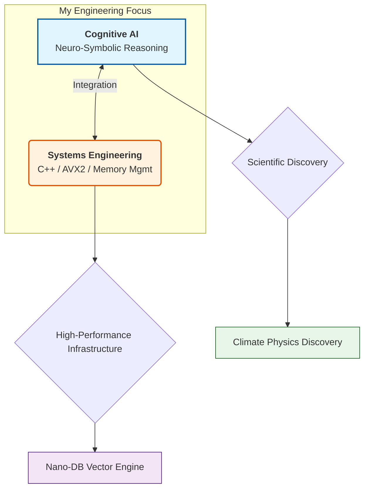

<div align="center">

# Hi there, I'm Shlok Vaishnav 👋

### 🧬 Engineering Intelligence | ⚡ Optimizing Systems
*Building AI that reasons like a scientist and runs like a high-frequency trading engine.*

[](YOUR_LINKEDIN_URL)
[](mailto:YOUR_EMAIL)
[](LINK_TO_YOUR_RESUME)

</div>

---

## 🚀 The Elevator Pitch
I am a **Computer Science Undergraduate at Nirma University** focusing on the "Hard Problems" in AI. 

While many build models, I engineer **architectures**. My work bridges the gap between **High-Performance Computing (HPC)** and **Cognitive AI**. I build systems that are:
1.  **Interpretable:** Using Neuro-Symbolic methods to extract physical laws from data.
2.  **Performant:** Writing custom C++ vector engines with AVX2 optimizations because Python isn't always fast enough.

---

## 🧠 My Architecture: The Intersection


---

## 🛠️ Featured Engineering

| **Project** | **The Engineering Challenge** | **Tech Stack** |
| --- | --- | --- |
| **🧪 climate-equation-discovery**<br>

<br>*(Autonomous AI Scientist)* | **Challenge:** Black-box models fail to respect physics. <br>

<br> **Solution:** Built a Neuro-Symbolic agent combining **PySR** & **PINNs** with thermodynamic constraints to *discover* governing ocean equations autonomously. | `Python` `JAX` `PySR` `Physics-Informed NN` |
| **⚡ nano-db**<br>

<br>*(High-Performance Vector Engine)* | **Challenge:** Standard search is slow without hardware optimization. <br>

<br> **Solution:** Engineered a persistent vector search engine from scratch using **Disk-based HNSW indexing** and **AVX2 SIMD instructions** for maximum throughput. | `C++` `SIMD/AVX2` `Python Bindings` `Multi-threading` |
| **👥 DataScienceClub_ITNU**<br>

<br>*(Community Platform)* | **Challenge:** Fostering a collaborative AI environment.<br>

<br> **Solution:** Developed the official platform for Nirma University's DS community. | `TypeScript` `Web Architecture` |

---

## 💻 The Technical Arsenal

*I don't just use libraries; I understand how they work under the hood.*

| **Domain** | **Technologies** |
| --- | --- |
| **🧠 AI Research** | **PINNs** |
| **⚙️ Systems & Low Level** | **Vector Databases (HNSW)** |
| **📐 Mathematics** | `Linear Algebra` `Probabilistic Graphical Models` `Differential Equations` |
| **🔧 Tools** |  |

---

<div align="center">

### 📊 GitHub Activity


</div>

```

  * **Action:** Ensure `nano-db` has a section titled **"Performance Benchmarks"** showing how fast your AVX2 implementation is compared to a naive implementation. That is what gets people hired at top companies.

```
